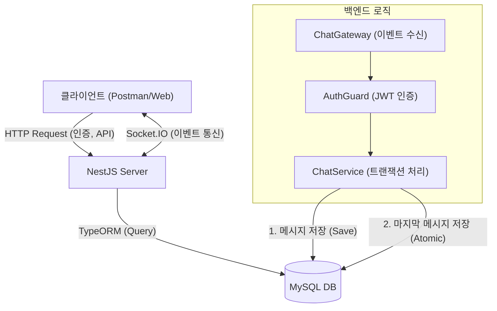
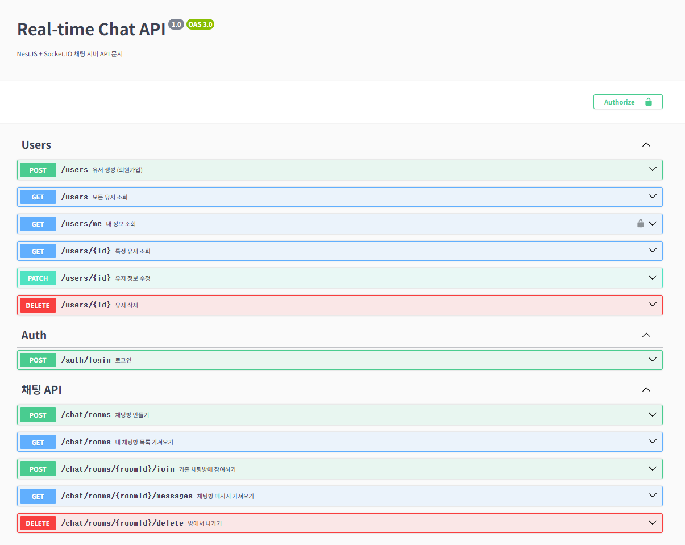
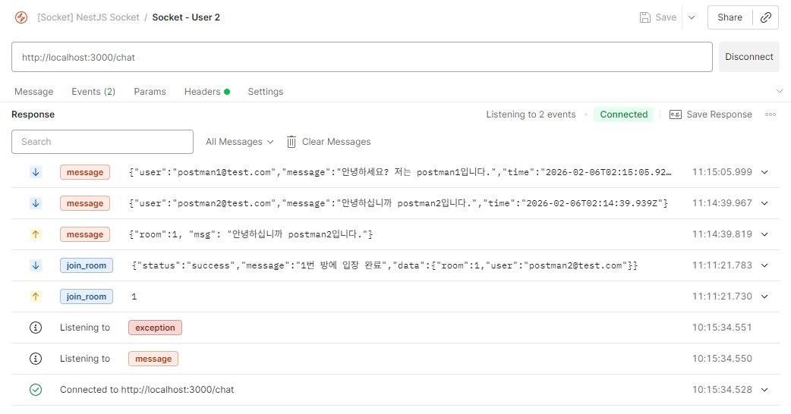
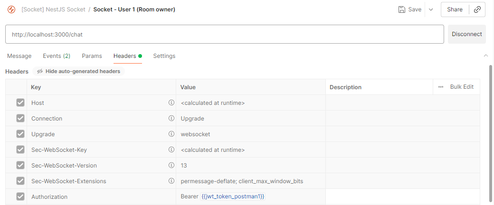
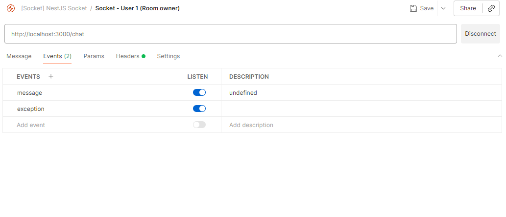
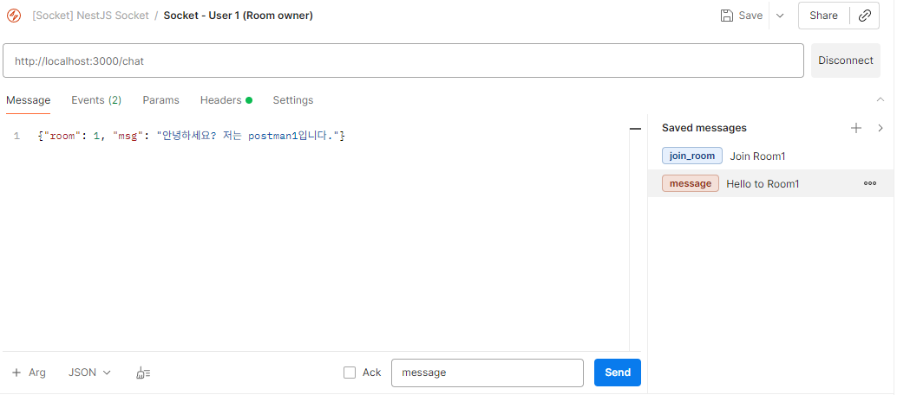

# Real-time Chat Service (NestJS + Socket.IO)

NestJS와 Socket.IO를 활용하여 설계한 실시간 채팅 서비스로,
대규모 트래픽 상황을 고려한 DB 설계와 안정적인 메시지 전송을 위한 아키텍처 구현에 집중했습니다.

## 🛠 Tech Stack
- **Framework:** NestJS
- **Language:** TypeScript
- **Database:** MySQL, TypeORM
- **Real-time:** Socket.IO
- **Testing:** Postman
## 🏗 System Architecture



## 🚀 How to Run (실행 방법)

이 프로젝트는 **Infrastructure(MySQL, Redis)는 Docker**로 구동하고, **Application(NestJS)은 로컬**에서 실행하도록 구성되어 있습니다.

### 1. 사전 준비
* Node.js (v16 이상)
* Docker & Docker Compose

### 2. Installation & Running
터미널에서 아래 명령어를 순서대로 입력해주세요.

```bash
# 1. 프로젝트 클론 및 이동
git clone https://github.com/pourquoi21/nestjs-chat-server.git
cd nestjs-chat-server

# 2. 패키지 설치
npm install

# 3. 환경 변수 설정 (.env)
# 프로젝트 루트에 .env.example 파일이 있다면 .env로 복사하여 사용하세요.
# (DB Port: 3307, Redis Port: 6379)
cp .env.example .env

# 4. 인프라 실행 (MySQL, Redis)
docker-compose up -d

# 5. 서버 실행
npm run start
```

## 💡 Key Features & Technical Decisions

### 1. 성능 최적화를 위한 역정규화
- **문제:** 채팅방 목록 조회 시, 각 방의 '마지막 메시지'를 가져오기 위해 `message` 테이블을 매번 조회하는 것은 성능 저하를 유발한다고 판단했습니다.
- **해결:** `ChatRoom` 테이블에 `last_message`와 `last_message_at` 컬럼을 추가하였습니다.
- **구현:** 메시지 전송 시 **Transaction**을 사용하여 `ChatMessage` 저장과 `ChatRoom` 업데이트가 원자성을 보장하여 이루어지도록 하였습니다.

### 2. Socket.IO와 HTTP API의 역할 분리
- **소켓(Gateway):** 실시간성이 중요한 '메시지 전송', '입장 알림' 등 **이벤트 중심**의 통신을 담당합니다.
- **HTTP API:** '방 생성', '로그인', '과거 대화 내역 조회' 등 **데이터의 영속성과 상태 관리**가 필요한 기능을 담당합니다.
- **안정성:** 소켓 연결이 끊겨도 HTTP API를 통해 데이터를 조회할 수 있도록 하여 서비스 안정성을 높였습니다.

### 3. 소켓 에러 처리 (Socket Exception)
- Socket.IO의 기본 `error` 이벤트가 클라이언트의 연결을 끊는 문제를 발견했습니다.
- 이를 해결하기 위해 `exception`이라는 커스텀 이벤트를 사용하여, 연결을 유지하면서도 명확한 에러 메시지를 전달하도록 개선했습니다.

## 📚 API Documentation

### 1. Swagger UI

서버 실행 후 브라우저에서 API 명세를 확인하고 간편하게 테스트할 수 있습니다.

* **URL:** [http://localhost:3000/api](https://www.google.com/search?q=http://localhost:3000/api)


### 2. Postman Test Guide
* 프로젝트 루트의 `docs/` 폴더에 있는 `[HTTP] NestJS Chat API.postman_collection.json`(Http 요청)과 `[ENV] NestJS Chat - Local.postman_environment.json`(환경 변수)을 Import 해주세요.
* Postman의 Socket 기능은 하단의 **[Socket.IO 수동 설정 가이드]** 를 참고해주세요.

### ✅ 1. 준비
이 프로젝트는 `docker-compose` 실행 시 `init.sql`을 통해 **테스트용 계정과 채팅방이 자동으로 생성**됩니다. 별도의 회원가입 없이 바로 테스트 가능합니다.

* **기본 계정 1:** `postman1@test.com` / `1234`
* **기본 계정 2:** `postman2@test.com` / `1234`
* **기본 채팅방:** `ID: 1` (테스트방)

### ✅ 2. 테스트 시나리오
#### **Step 0: 회원가입 (Optional)**
* `init.sql`의 계정 외에 새로운 유저를 생성해보고 싶다면 **[HTTP] Create Test2 User** 요청을 실행하시면, 새로운 유저(`test2`)가 DB에 생성됩니다.

#### **Step 1: 로그인 및 토큰 발급**
* **[HTTP] Postman1 Login** 요청을 실행합니다.
    * 응답받은 Access Token이 자동으로 환경변수 `{{jwt_token_postman1}}`에 저장됩니다.
* **[HTTP] Postman2 Login** 요청을 실행합니다.
    * 응답받은 Access Token이 자동으로 환경변수 `{{jwt_token_postman2}}`에 저장됩니다.

#### **Step 2: 채팅방 참여 (HTTP)**
* **[HTTP] Postman2 joins room N** 요청을 실행합니다.
    * 기본 생성된 **1번 방**에 Postman2 유저가 참여합니다. (Postman1은 이미 멤버입니다)

#### **Step 3: 소켓 연결 및 메시지 전송 (Socket.IO)**
*Note: 실시간 통신 확인을 위해 두 개의 Socket 탭을 열어주세요. 상세 설정은 하단 [수동 설정 가이드]를 참고하세요.
 1. **User 1 연결 (수신 대기):** `{{jwt_token_postman1}}`을 사용하는 탭
    * **Connect** 클릭 → `join_room` 이벤트 전송 (Message: `1`)
 2. **User 2 연결 (송신):** `{{jwt_token_postman2}}`를 사용하는 새로운 탭
    * **Connect** 클릭 → `join_room` 이벤트 전송 (Message: `1`)
    * `message` 이벤트 전송 (Message: `{"room": 1, "msg": "안녕"}`) → Ack 응답 확인
 3. **User 1 확인:** User 1 탭의 메시지 로그에 "안녕" 메시지가 실시간으로 수신되었는지 확인합니다.

#### **Step 4: 데이터 조회 및 검증**
* **[HTTP] Postman2 gets her rooms**
    * 채팅방 목록에서 방금 보낸 메시지가 `last_message`로 업데이트되었는지 확인합니다. (역정규화 검증)
* **[HTTP] Postman2 reads messages**
    * 방금 나눈 대화 내용이 최신순으로 조회되는지 확인합니다.

>  **📸 Test Result (성공적인 메시지 조회 결과)**
> > 
---

### 🔌 Socket.IO 수동 설정 가이드
> **💡 Socket 설정 예시 이미지**
> 
> 
> 

아래 설정으로 새로운 탭을 열어주세요.

| 구분         | 설정값                              | 비고                                     |
|:-----------|:---------------------------------|:---------------------------------------|
| **URL**    | `http://localhost:3000`          |                                        |
| **Auth**   | Bearer Token                     | `{{jwt_token_postman1}}` 등의 변수 사용      |
| **Events** | `join_room`                      | 메시지: `1` (방번호, Int)                    |
| **Events** | `message`                        | 메시지: `{"room": 1, "msg": "안녕"}` (JSON) |
| **Listen** | `message`, `exception`, `notice` | `Events` 탭에서 리스너 추가                    |

## 🚀 Future Improvements
- 현재 `OFFSET` 방식의 페이지네이션을 사용 중이나, 추후 대량의 메시지 처리를 위해 `Cursor-based Pagination`으로 고도화할 계획입니다.


