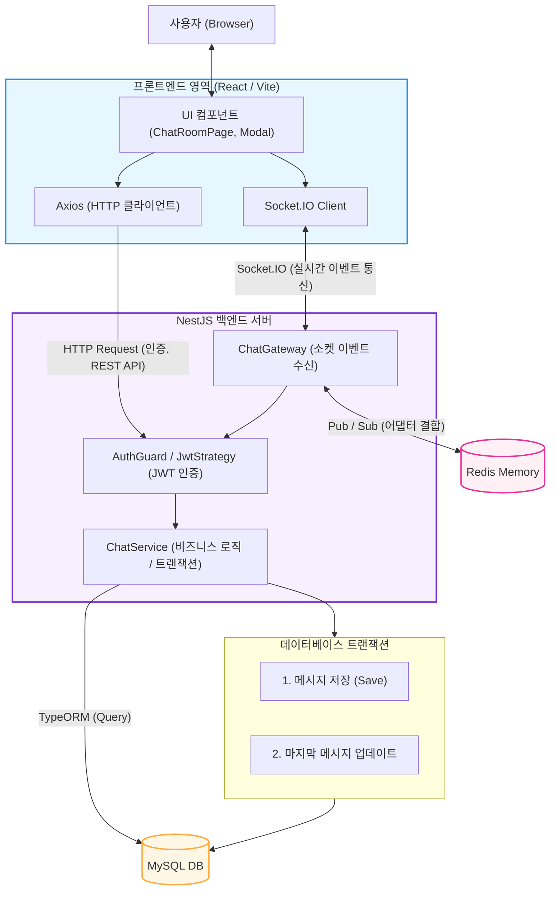

# Real-time Chat Service (NestJS + Socket.IO)

NestJS와 Socket.IO를 활용하여 설계한 실시간 채팅 서비스입니다.
백엔드 API서버와 React 프론트엔드를 직접 구현하였으며, WSL Ubuntu 환경에서 개발하였습니다.

## 🛠 Tech Stack
| 구분 | 기술 |
|------|------|
| Backend | NestJS, TypeScript, TypeORM, MySQL, Socket.IO, JWT, Passport |
| Frontend | React, Vite, TypeScript, Axios, Socket.IO-client |
| Infra | Docker (MySQL, Redis) |
| Docs | Swagger |

---
## 🏗 System Architecture


```mermaid
graph TD
    %% 1. 클라이언트 및 프론트엔드 레이어
    User["사용자 (Browser)"]
    subgraph Frontend_App ["프론트엔드 영역 (React / Vite)"]
        UI["UI 컴포넌트 (ChatRoomPage, Modal)"]
        Axios["Axios (HTTP 클라이언트)"]
        SocketClient["Socket.IO Client"]
        
        UI --> Axios
        UI --> SocketClient
    end

    User <--> UI

    %% 2. 백엔드 서버 레이어
    subgraph Server_Logic ["NestJS 백엔드 서버"]
        direction TB
        Auth["AuthGuard / JwtStrategy (JWT 인증)"]
        Gateway["ChatGateway (소켓 이벤트 수신)"]
        Service["ChatService (비즈니스 로직 / 트랜잭션)"]
        
        Gateway --> Auth
        Auth --> Service
    end

    %% 3. 인프라 및 스토리지 레이어
    DB[(MySQL DB)]
    Redis[(Redis Memory)]

    %% HTTP 및 소켓 흐름 연결
    Axios -- "HTTP Request (인증, REST API)" --> Auth
    SocketClient -- "Socket.IO (실시간 이벤트 통신)" <--> Gateway

    %% 내부 데이터 및 인프라 흐름
    Service -- "TypeORM (Query)" --> DB
    Gateway -- "Pub / Sub (어댑터 결합)" <--> Redis

    %% 데이터베이스 세부 트랜잭션 흐름
    subgraph DB_Transaction ["데이터베이스 트랜잭션"]
        direction LR
        T1["1. 메시지 저장 (Save)"]
        T2["2. 마지막 메시지 업데이트"]
    end
    Service --> DB_Transaction
    DB_Transaction --> DB

    %% 스타일링 (시각적 가시성 확보)
    style Frontend_App fill:#e6f7ff,stroke:#1890ff,stroke-width:2px
    style Server_Logic fill:#f9f0ff,stroke:#722ed1,stroke-width:2px
    style DB fill:#fff7e6,stroke:#ffa940,stroke-width:2px
    style Redis fill:#fff0f6,stroke:#eb2f96,stroke-width:2px
```
---

## 🏗 Project Structure

```
root/
├── docker-compose.yml
├── init.sql
├── backend/
│   ├── src/
│   └── .env.example
└── frontend/
    └── src/
```

---

## 🚀 How to Run (실행 방법)

### 사전 준비
- Node.js v20 이상
- Docker & Docker Compose

### 1. 클론 및 이동
```bash
git clone https://github.com/pourquoi21/nestjs-chat-server.git
cd nestjs-chat-server
```

### 2. 인프라 실행 (MySQL, Redis)
```bash
docker-compose up -d
```
init.sql을 통해 테스트용 계정과 채팅방이 자동으로 생성됩니다.

### 3. 백엔드 실행
```bash
cd backend
# 프로젝트 루트의 .env.example파일을 복사하여 .env 파일로 만들어주세요.
cp .env.example .env
npm install
npm run start:dev
```

### 4. 프론트엔드 실행
```bash
cd frontend
npm install
npm run dev
```

### 5. 접속
브라우저에서 http://localhost:5173 접속

#### 기본 계정
- postman1@test.com / 1234
- postman2@test.com / 1234

#### API 문서: http://localhost:4000/api (Swagger)


---

## 💡 Key Features & Technical Decisions

### 1. 성능 최적화를 위한 역정규화
채팅방 목록 조회 시 마지막 메시지를 가져오기 위해 매번 message 테이블을 조회하는 것은 성능 저하를 유발한다고 판단하였습니다.  
ChatRoom 테이블에 `last_message`, `last_message_at` 컬럼을 추가하고, 메시지 전송 시 Transaction을 사용하여 ChatMessage 저장과 ChatRoom 업데이트가 원자적으로 이루어지도록 하였습니다.

### 2. Socket.IO와 HTTP API의 역할 분리
- 소켓(Gateway): 실시간성이 중요한 메시지 전송, 입장 알림 등 이벤트 중심 통신을 담당합니다.
- HTTP API: 방 생성, 로그인, 과거 대화 내역 조회 등 데이터의 영속성과 상태 관리가 필요한 기능을 담당합니다.
- 소켓 연결이 끊겨도 HTTP API를 통해 데이터를 조회할 수 있도록 하여 서비스 안정성을 높였습니다.

### 3. 소켓 이벤트 단위 JWT 인증 (WsJwtGuard)
`handleConnection`의 연결 시점 검증만으로는 토큰 만료 후에도 이미 연결된 소켓으로 이벤트 전송이 가능한 허점이 있었습니다.  
`WsJwtGuard`를 구현하여 각 이벤트 핸들러에서도 토큰을 재검증하도록 개선하였습니다.

### 4. 소켓 연결 타이밍 문제 해결 (ready 이벤트)
클라이언트에서 소켓 연결(`connect`) 시점에 `join_room`을 함께 전송하면, 서버의 `handleConnection` 처리가 끝나기 전에 `join_room`이 도달하여 무시되는 문제가 있었습니다.  
`setTimeout`으로 임시 처리했다가, 서버에서 인증 완료 후 `ready` 이벤트를 클라이언트에 emit하고 클라이언트는 이를 수신한 시점에 `join_room`을 전송하는 방식으로 개선하였습니다.

### 5. nickname DB 조회 방식
JWT 페이로드에 nickname을 싣는 대신, `handleConnection` 시점에 DB를 조회하여 최신 nickname을 가져오도록 하였습니다.  
닉네임 변경 시에도 소켓에 즉시 반영될 수 있습니다.

### 6. 소켓 에러 처리 (커스텀 exception 이벤트)
Socket.IO의 기본 `error` 이벤트는 클라이언트 연결을 끊는 문제가 있었습니다.  
`exception`이라는 커스텀 이벤트를 사용하여 연결을 유지하면서도 명확한 에러 메시지를 전달하도록 개선하였습니다.

### 7. Cursor-based Pagination
OFFSET 방식 대신 마지막 메시지 ID를 cursor로 사용하여
대량 메시지 환경에서도 일정한 조회 성능을 유지하도록 구현하였습니다.

---
## 🚀 Future Improvements
- 채팅방 초대 기능 구현
- 채팅방 퇴장 기능 프론트엔드 연동 (백엔드 API 구현 완료)
- 초대/퇴장 시 실시간 알림
